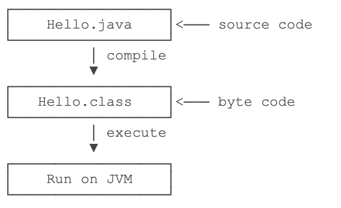

# Java学习笔记

本篇采用jdk16版本

学习教程：https://www.liaoxuefeng.com/wiki/1252599548343744

## 为什么Java应用最广泛？

- 从互联网到企业平台，Java是应用最广泛的编程语言，原因在于：
- Java是基于JVM虚拟机的跨平台语言，一次编写，到处运行；
- Java程序易于编写，而且有内置垃圾收集，不必考虑内存管理；
- Java虚拟机拥有工业级的稳定性和高度优化的性能，且经过了长时期的考验；
- Java拥有最广泛的开源社区支持，各种高质量组件随时可用。

## Java语言常年霸占着三大市场：

- 互联网和企业应用，这是Java EE的长期优势和市场地位；
- 大数据平台，主要有Hadoop、Spark、Flink等，他们都是Java或Scala（一种运行于JVM的编程语言）开发的；
- Android移动平台。

这意味着Java拥有最广泛的就业市场。

## JDK安装

## 第一个程序

1. 使用编辑器，输入以下代码（注意：文件后缀.java）
   ```java
    public class Hello {
        public static void main(String[] args) {
            System.out.println("Hello, world");
        }
    }
   ```
2. Java程序的说明
    - 在一个Java程序中，你总能找到一个类似：
      ```java
      public class Hello {
        // ...
      }
      ```
    - 这个定义被称为class(类)，这里的类名是Hello，大小写敏感，class用来定义一个类，public表示这个类是公开的
    - public、class都是Java的关键字，必须小写，Hello是类的名字，按照习惯，首字母H要大写
    - 花括号{}中间则是类的定义
3. main方法
    ```java
    public static void main(String[] args) {
        // ...
    }
    ```
    - 方法是可执行的代码块，一个方法除了方法名main，还有用()括起来的方法参数，这里的main方法有一个参数，参数类型是String[]
      ，参数名是args，public、static用来修饰方法，这里表示它是一个公开的静态方法，void是方法的返回类型，而花括号{}中间的就是方法的代码。
4. 方法的代码每一行用;结束
    ```java
    System.out.println("Hello, world");
    ```

Java规定，某个类定义的public static void main(String[] args)是Java程序的固定入口方法，因此，Java程序总是从main方法开始执行。

注意到Java源码的缩进不是必须的，但是用缩进后，格式好看，很容易看出代码块的开始和结束，缩进一般是4个空格或者一个tab。

最后，当我们把代码保存为文件时，文件名必须是Hello.java，而且文件名也要注意大小写，因为要和我们定义的类名Hello完全保持一致。

## 如何运行Java程序

Java源码本质上是一个文本文件，我们需要先用javac把Hello.java编译成字节码文件Hello.class，然后，用java命令执行这个字节码文件：

从上图可知，可执行文件javac是编译器，而可执行文件java就是虚拟机。

- 第一步，在保存Hello.java的目录下执行命令javac Hello.java：
  ```shell
  $ javac Hello.java
  ```
  如果源代码无误，上述命令不会有任何输出，而当前目录下会产生一个Hello.class文件：
  ```shell
  $ ls
  Hello.class	Hello.java
  ```
- 第二步，执行Hello.class，使用命令java Hello：
    ```shell
    $ java Hello
    Hello, world!
    ```
  注意：给虚拟机传递的参数Hello是我们定义的类名，虚拟机自动查找对应的class文件并执行。

  直接执行java Hello.java也是可以的：
  ```shell
  $ java Hello.java 
  Hello, world!
  ```

1. 一个Java源码只能定义一个public类型的class，并且class名称和文件名要完全一致；
2. 使用javac可以将.java源码编译成.class字节码；
3. 使用java可以运行一个已编译的Java程序，参数是类名。

## Java程序基本结构

我们先看一个完整地Java程序的：

```java
/**
 * 可以用来自动创建文档的注释
 */
public class Hello {
    public static void main(String[] args) {
        // 向屏幕刷出文本
        System.out.println("Hello, world!");
        /* 多行注释开始
                注释内容
         注释结束*/
    }
// class定义结束
}
```

因为Java是面向对象的语言，一个程序的基本单位就是class，class是关键字，这里定义的class名字就是Hello：

```java
// 类名是Hello
public class Hello {
    // ...
// class定义结束
}
```

类名要求：

- 类名必须以英文字母开头，后接字母，数字和下划线的组合
- 习惯以大写字母开头

要注意遵守命名习惯，**好的**类命名：

- Hello
- NoteBook
- VRPlayer

**不好的**类命名：

- hello
- Good123
- Note_Book
- _World

注意：public是访问修饰符，表示class是公开的，不写public，也能正确编译，但是这个类将无法从命令行执行。

在class内部，可以定义若干方法（method）：

```java
public class Hello {
    // 方法名是main
    public static void main(String[] args) {
        // 方法代码...
        // 方法定义结束
    }
}
```

方法定义了一组执行语句，方法内部的代码将会被依次顺序执行。 这里的方法名是main，返回值是void，表示没有任何返回值。

我们注意到public除了可以修饰class外，也可以修饰方法。而关键字static是另一个修饰符，它表示静态方法，后面我们会讲解方法的类型，目前，我们只需要知道，Java入口程序规定的方法必须是静态方法，方法名必须为main，括号内的参数必须是String数组

方法名也有命名规则，命名和class一样，但是首字母小写：

**好的**方法命名：

- main
- goodMorning
- playVR

**不好的**方法命名：

- Main
- good123
- good_morning
- _playVR

在方法内部，语句才是真正的执行代码。Java的每一行语句必须以分号结束：

```java
public class Hello {
    public static void main(String[] args) {
        // 语句
        System.out.println("Hello, world!");
    }
}
```

## 注释

在Java程序中，注释是一种给人阅读的文本，不是程序的一部分，所以编译器会自动忽略注释。

Java有3种：

### 第一种：单行注释，以双斜线开头，直到这一行的结尾结束

```java
// 这是注释...
```

### 第二种：多行注释以`/*`星号开头，以`*/`结束，可以有多行

```java
/*
        balabalabala……
 */
```

### 第三种：特殊的多行注释，以`/**`开头，以`*/`结束，如果有多行，每行通常以星号开头

```java
/**
 * 可以用来自动创建文档的注释
 *
 * @auther jing
 */
```

这种特殊的多行注释需要写在类和方法的定义处，可以用于自动创建文档。