# 变量

## 什么是变量

变量就是初中数学的代数的概念，例如一个简单的方程，x，y都是变量：y=x²+1

在Java中，变量分为两种：**基本类型**的变量和**引用类型**的变量

## 基本类型的变量

在Java中，变量必须先定义后使用，在定义变量的时候，可以给它一个初始值。例如：

```
int x=1;
```

上述语句定义了一个整型int类型的变量，名称为x，初始值为1。

如果不写初始值，就相当于给它指定了默认值。默认值总是0。（基本类型的变量都是有默认值的）

```java
package com.learn.variable;

/**
 * @author jinglv
 * @date 2021/5/12 5:25 下午
 */
public class PrintVariable {
    public static void main(String[] args) {
        // 定义int类型变量x，并赋予初始值100
        int x = 100;
        // 打印该变量
        System.out.println(x);
    }
}
```

变量的一个重要特点是可以重新赋值。例如，对变量x，先赋值100，再赋值200，观察两次打印的结果：

```java
package com.learn.variable;

/**
 * 重新赋值变量
 *
 * @author jinglv
 * @date 2021/5/12 5:27 下午
 */
public class AgainVariable {
    public static void main(String[] args) {
        // 定义int类型变量x，并赋予初始值100
        int x = 100;
        // 打印该变量值，观察是否为100
        System.out.println(x);
        // 重新赋值为200
        x = 200;
        // 打印该变量的值，观察是否为200
        System.out.println(x);
    }
}
```

注意：第一次定义变量x的时候，需要指定变量类型int，因此使用语句int x = 100;。而第二次重新赋值的时候，变量x已经存在了，不能再重复定义，因此不能指定变量类型int，必须使用语句x = 200;。

变量不但可以重新赋值，还可以赋值给其他变量。来看一个例子：

```java
package com.learn.variable;

/**
 * 变量之间的赋值
 *
 * @author jinglv
 * @date 2021/5/12 5:31 下午
 */
public class VariableAssignment {
    public static void main(String[] args) {
        // 定义变量n，同时赋值为100
        int n = 100;
        // 打印n的值
        System.out.println("n=" + n);
        // 变量n赋值为200
        n = 200;
        // 打印n的值
        System.out.println("n=" + n);
        // 变量x赋值为n(n的值为200，因此赋值后x的值也是200)
        int x = n;
        // 打印x的值
        System.out.println("x=" + x);
        // 变量x赋值为x+100（x的值为200，因此赋值后x的值是200+100=300）
        x = x + 100;
        // 打印x的值，300
        System.out.println("x=" + x);
        // 再次打印n的值，n应该是200还是300？是200
        System.out.println("n=" + n);
    }
}
```

对上述代码进行分析：

1. 执行int n = 100;，该语句定义了变量n，同时赋值为100，因此，JVM在内存中为变量n分配一个“存储单元”，填入值100：

   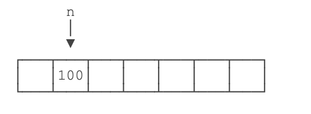

2. 执行n = 200;时，JVM把200写入变量n的存储单元，因此，原有的值被覆盖，现在n的值为200：

   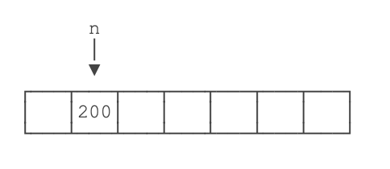

3. 执行int x = n;时，定义了一个新的变量x，同时对x赋值，因此，JVM需要新分配一个存储单元给变量x，并写入和变量n一样的值，结果是变量x的值也变为200：

   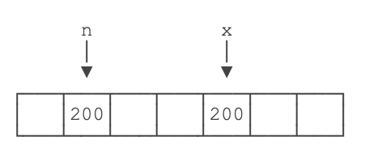

4. 执行x = x + 100;时，JVM首先计算等式右边的值x + 100，结果为300（因为此刻x的值为200），然后，将结果300写入x的存储单元，因此，变量x最终的值变为300：

   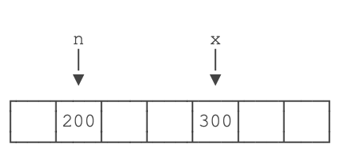

可见，变量可以反复赋值。注意，等号=是赋值语句，不是数学意义上的相等，否则无法解释x = x + 100。

# 基本数据类型

基本数据类型是CPU可以直接进行运算的类型。Java定义了以下几种基本数据类型：

- 整数类型：byte，short，int，long
- 浮点数类型：float，double
- 字符类型：char
- 布尔类型：boolean

## Java定义的这些基本数据类型有什么区别呢？

要了解这些区别，我们就必须简单了解一下计算机内存的基本结构。

计算机内存的最小存储单元是字节（byte），一个字节就是一个8位二进制数，即8个bit。它的二进制表示范围从00000000~11111111，换算成十进制是0~255，换算成十六进制是00~ff。

内存单元从0开始编号，称为内存地址。每个内存单元可以看作一间房间，内存地址就是门牌号。

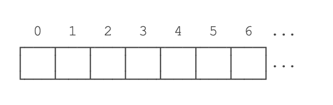

一个字节是1byte，1024字节是1K，1024K是1M，1024M是1G，1024G是1T。一个拥有4T内存的计算机的字节数量就是：

```
4T = 4 x 1024G
   = 4 x 1024 x 1024M
   = 4 x 1024 x 1024 x 1024K
   = 4 x 1024 x 1024 x 1024 x 1024
   = 4398046511104
```

不同的数据类型占用的字节数不一样。我们看一下Java基本数据类型占用的字节数：

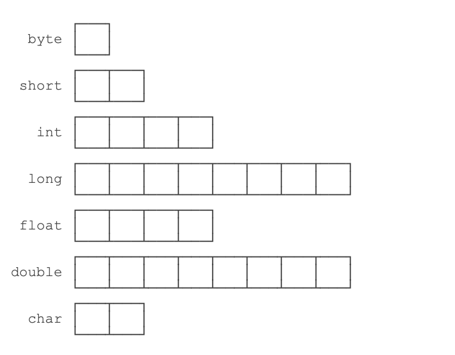

byte恰好就是一个字节，而long和double需要8个字节。

## 整型

对于整型类型，Java只定义了带符号的整型，因此，最高位的bit表示符号位（0表示正数，1表示负数）。各种整型能表示的最大范围如下：

- byte：-128 ~ 127
- short: -32768 ~ 32767
- int: -2147483648 ~ 2147483647
- long: -9223372036854775808 ~ 9223372036854775807

```java
package com.learn.variable;

/**
 * 定义整型
 *
 * @author jinglv
 * @date 2021/5/12 6:02 下午
 */
public class IntegerVariable {
    public static void main(String[] args) {
        int i = 2147483647;
        int i2 = -2147483647;
        // 加下划线更容易识别
        int i3 = 2_000_000_000;
        // 十六进制表示的16711680
        int i4 = 0xff0000;
        // 二进制表示的512
        int i5 = 0b1000000000;
        // long型的结尾需要加L
        long l = 9000000000000000000L;
    }
}
```

特别注意：同一个数的不同进制的表示是完全相同的，例如15=0xf＝0b1111。

## 浮点型

浮点类型的数就是小数，因为小数用科学计数法表示的时候，小数点是可以“浮动”的，如1234.5可以表示成12.345x102，也可以表示成1.2345x103，所以称为浮点数。

定义浮点数的例子：

```
float f1 = 3.14f;
float f2 = 3.14e38f; // 科学计数法表示的3.14x10^38
double d = 1.79e308;
double d2 = -1.79e308;
double d3 = 4.9e-324; // 科学计数法表示的4.9x10^-324
```

对于float类型，需要加上f后缀。

浮点数可表示的范围非常大，float类型可最大表示3.4x10^38，而double类型可最大表示1.79x10^308。

## 布尔类型

布尔类型boolean只有true和false两个值，布尔类型总是关系运算的计算结果：

```
boolean b1 = true;
boolean b2 = false;
boolean isGreater = 5 > 3; 
int age = 12;
boolean isAdult = age >= 18; // 计算结果为false
```

Java语言对布尔类型的存储并没有做规定，因为理论上存储布尔类型只需要1 bit，但是通常JVM内部会把boolean表示为4字节整数。

## 字符类型

字符类型char表示一个字符。Java的char类型除了可表示标准的ASCII外，还可以表示一个Unicode字符：

```java
package com.learn.variable;

/**
 * 定义字符类型的变量
 *
 * @author jinglv
 * @date 2021/5/12 6:09 下午
 */
public class StringVariable {
    public static void main(String[] args) {
        char a = 'A';
        char zh = '中';
        System.out.println(a);
        System.out.println(zh);
    }
}
```

注意char类型使用单引号'，且仅有一个字符，要和双引号"的字符串类型区分开。

## 引用类型

除了上述基本类型的变量，剩下的都是引用类型。例如，引用类型最常用的就是String字符串：

```
String s = "hello";
```

引用类型的变量类似于C语言的指针，它内部存储一个“地址”，指向某个对象在内存的位置。

# 常量

定义变量的时候，如果加上final修饰符，这个变量就变成了常量：

```
final double PI = 3.14; // PI是一个常量
double r = 5.0;
double area = PI * r * r;
PI = 300; // compile error!
```

常量在定义时进行初始化后就不可再次赋值，再次赋值会导致编译错误。

常量的作用是用有意义的变量名来避免魔术数字（Magic number），例如，不要在代码中到处写3.14，而是定义一个常量。如果将来需要提高计算精度，我们只需要在常量的定义处修改，例如，改成3.1416，而不必在所有地方替换3.14。

根据习惯，**常量名通常全部大写**。

# var关键字

有些时候，类型的名字太长，写起来比较麻烦。例如：

```
StringBuilder sb = new StringBuilder();
```

这个时候，如果想省略变量类型，可以使用var关键字：

```
var sb = new StringBuilder();
```

编译器会根据赋值语句自动推断出变量sb的类型是StringBuilder。对编译器来说，语句：

```
var sb = new StringBuilder();
```

实际上会自动变成：

```
StringBuilder sb = new StringBuilder();
```

因此，使用var定义变量，仅仅是少写了变量类型而已。

# 变量的作用范围

在Java中，多行语句用{ }括起来。很多控制语句，例如条件判断和循环，都以{ }作为它们自身的范围，例如：

```
if (...) { // if开始
    ...
    while (...) { // while 开始
        ...
        if (...) { // if开始
            ...
        } // if结束
        ...
    } // while结束
    ...
} // if结束
```

只要正确地嵌套这些{ }，编译器就能识别出语句块的开始和结束。而在语句块中定义的变量，它有一个作用域，就是从定义处开始，到语句块结束。超出了作用域引用这些变量，编译器会报错。举个例子：

```
{
    ...
    int i = 0; // 变量i从这里开始定义
    ...
    {
        ...
        int x = 1; // 变量x从这里开始定义
        ...
        {
            ...
            String s = "hello"; // 变量s从这里开始定义
            ...
        } // 变量s作用域到此结束
        ...
        // 注意，这是一个新的变量s，它和上面的变量同名，
        // 但是因为作用域不同，它们是两个不同的变量:
        String s = "hi";
        ...
    } // 变量x和s作用域到此结束
    ...
} // 变量i作用域到此结束
```

定义变量时，要遵循作用域最小化原则，尽量将变量定义在尽可能小的作用域，并且，不要重复使用变量名。

# 整数运算

Java的整数运算遵循四则运算规则，可以使用任意嵌套的小括号。四则运算规则和初等数学一致。

```java
public class Main {
    public static void main(String[] args) {
        int i = (100 + 200) * (99 - 88); // 3300
        int n = 7 * (5 + (i - 9)); //23072
        System.out.println(i);
        System.out.println(n);
    }
}
```

整数的数值表示不但是精确的，而且整数运算永远是精确的，即使是除法也是精确的，因为两个整数相除只能得到结果的整数部分：

```
int x = 12345 / 67; // 184
```

求余运算使用%

```
int y = 12345 % 67; // 12345÷67的余数是17
```

特别注意：整数的除法对于除数为0时运行时将报错，但编译不会报错。

## 溢出

要特别注意，整数由于存在范围限制，如果计算结果超出了范围，就会产生溢出，而溢出不会出错，却会得到一个奇怪的结果：

```java
package com.learn.operation;

/**
 * 整数运算溢出
 *
 * @author jinglv
 * @date 2021/5/12 6:24 下午
 */
public class OverflowOperation {
    public static void main(String[] args) {
        int x = 2147483640;
        int y = 15;
        int sum = x + y;
        // 输出结果：-2147483641
        System.out.println(sum);
    }
}
```

要解释上述结果，我们把整数2147483640和15换成二进制做加法：

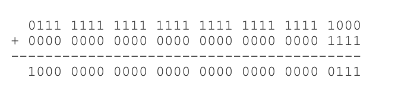

要解决上面的问题，可以把int换成long类型，由于long可表示的整型范围更大，所以结果就不会溢出

```
long x = 2147483640;
long y = 15;
long sum = x + y;
System.out.println(sum); // 2147483655
```

## 简写运算符

简写的运算符，即+=，-=，*=，/=，它们的使用方法如下：

```
n += 100; // 3409, 相当于 n = n + 100;
n -= 100; // 3309, 相当于 n = n - 100;
```

## 自增/自减

Java还提供了++运算和--运算，它们可以对一个整数进行加1和减1的操作：

```java
package com.learn.operation;

/**
 * 自增/自减运算
 *
 * @author jinglv
 * @date 2021/5/12 6:39 下午
 */
public class IncrementOperation {
    public static void main(String[] args) {
        int n = 3300;
        // 自增，3301，相当于n = n + 1;
        n++;
        // 自减，3300，相当于n = n - 1;
        n--;
        // ++n，先加1在运算，注意：不要这么写
        int y = 100 + (++n);
        System.out.println(y);
    }
}
```

注意++写在前面和后面计算结果是不同的，++n表示先加1再引用n，n++表示先引用n再加1。不建议把++运算混入到常规运算中，容易自己把自己搞懵了。

## 位移运算

在计算机中，整数总是以二进制的形式表示。例如，int类型的整数7使用4字节表示的二进制如下：

`00000000 0000000 0000000 00000111`

可以对整数进行移位运算。对整数7左移1位将得到整数14，左移两位将得到整数28：

```
int n = 7;       // 00000000 00000000 00000000 00000111 = 7
int a = n << 1;  // 00000000 00000000 00000000 00001110 = 14
int b = n << 2;  // 00000000 00000000 00000000 00011100 = 28
int c = n << 28; // 01110000 00000000 00000000 00000000 = 1879048192
int d = n << 29; // 11100000 00000000 00000000 00000000 = -536870912
```

左移29位时，由于最高位变成1，因此结果变成了负数。

类似的，对整数28进行右移，结果如下：

```
int n = 7;       // 00000000 00000000 00000000 00000111 = 7
int a = n >> 1;  // 00000000 00000000 00000000 00000011 = 3
int b = n >> 2;  // 00000000 00000000 00000000 00000001 = 1
int c = n >> 3;  // 00000000 00000000 00000000 00000000 = 0
```

如果对一个负数进行右移，最高位的1不动，结果仍然是一个负数：

```
int n = -536870912;
int a = n >> 1;  // 11110000 00000000 00000000 00000000 = -268435456
int b = n >> 2;  // 11111000 00000000 00000000 00000000 = -134217728
int c = n >> 28; // 11111111 11111111 11111111 11111110 = -2
int d = n >> 29; // 11111111 11111111 11111111 11111111 = -1
```

还有一种无符号的右移运算，使用>>>，它的特点是不管符号位，右移后高位总是补0，因此，对一个负数进行>>>右移，它会变成正数，原因是最高位的1变成了0：

```
int n = -536870912;
int a = n >>> 1;  // 01110000 00000000 00000000 00000000 = 1879048192
int b = n >>> 2;  // 00111000 00000000 00000000 00000000 = 939524096
int c = n >>> 29; // 00000000 00000000 00000000 00000111 = 7
int d = n >>> 31; // 00000000 00000000 00000000 00000001 = 1
```

对byte和short类型进行移位时，会首先转换为int再进行位移。

仔细观察可发现，左移实际上就是不断地×2，右移实际上就是不断地÷2。

## 位运算

位运算是按位进行与、或、非和异或的运算。

与运算的规则是，必须两个数同时为1，结果才为1：

```
n = 0 & 0; // 0
n = 0 & 1; // 0
n = 1 & 0; // 0
n = 1 & 1; // 1
```

或运算的规则是，只要任意一个为1，结果就为1：

```
n = 0 | 0; // 0
n = 0 | 1; // 1
n = 1 | 0; // 1
n = 1 | 1; // 1
```

非运算的规则是，0和1互换：

```
n = ~0; // 1
n = ~1; // 0
```

异或运算的规则是，如果两个数不同，结果为1，否则为0：

```
n = 0 ^ 0; // 0
n = 0 ^ 1; // 1
n = 1 ^ 0; // 1
n = 1 ^ 1; // 0
```

对两个整数进行位运算，实际上就是按位对齐，然后依次对每一位进行运算。例如：

```java
package com.learn.operation;

/**
 * 位运算
 *
 * @author jinglv
 * @date 2021/5/13 4:16 下午
 */
public class BitOperation {
    public static void main(String[] args) {
        // 转换为二进制：00001010 00000000 00010001 01001101
        int i = 167776589;
        // 转换为二进制：00001010 00000000 00010001 00000000
        int n = 167776512;
        // 结果：167776512
        System.out.println(i & n);
    }
}
```

上述按位与运算实际上可以看作两个整数表示的IP地址10.0.17.77和10.0.17.0，通过与运算，可以快速判断一个IP是否在给定的网段内。

## 运算优先级

在Java的计算表达式中，运算优先级从高到低依次是：

- `()`
- `!` `~` `++` `--`
- `*` `/` `%`
- `+` `-`
- `<<` `>>` `>>>`
- `&`
- `|`
- `+=` `-=` `*=` `/=`

注意：只需要加括号就可以保证运算的优先级正确

## 类型自动提升与强制转型

在运算过程中，如果参与运算的两个数类型不一致，那么计算结果为较大类型的整型。例如，short和int计算，结果总是int，原因是short首先自动被转型为int：

```java
package com.learn.operation;

/**
 * 类型自动提升与强制转型
 *
 * @author jinglv
 * @date 2021/5/13 5:17 下午
 */
public class TransitionOperation {
    public static void main(String[] args) {
        short s = 1234;
        int i = 123456;
        // s自动转型为int
        int x = s + i;
        // 编译错误
        // short y = s + i;
    }
}
```

也可以将结果强制转型，即将大范围的整数转型为小范围的整数。强制转型使用(类型)，例如，将int强制转型为short：

```
int i = 12345;
short s = (short) i; // 12345
```

要注意，超出范围的强制转型会得到错误的结果，原因是转型时，int的两个高位字节直接被扔掉，仅保留了低位的两个字节：

```java
package com.learn.operation;

/**
 * 强制转型
 *
 * @author jinglv
 * @date 2021/5/13 5:21 下午
 */
public class ConstraintTransitionOperation {
    public static void main(String[] args) {
        int i1 = 1234567;
        short s1 = (short) i1;
        // 结果：-10617
        System.out.println(s1);
        int i2 = 12345678;
        short s2 = (short) i2;
        // 结果：24910
        System.out.println(s2);
    }
}
```

# 浮点数运算

浮点数运算和整数运算相比，只能进行**加减乘除这些数值计算**，不能做位运算和移位运算。

在计算机中，浮点数虽然表示的范围大，但是，浮点数有个非常重要的特点，就是浮点数常常无法精确表示。

举个栗子：

浮点数0.1在计算机中就无法精确表示，因为十进制的0.1换算成二进制是一个无限循环小数，很显然，无论使用float还是double，都只能存储一个0.1的近似值。但是，0.5这个浮点数又可以精确地表示。

因为浮点数常常无法精确表示，因此，浮点数运算会产生误差：

```java
package com.learn.operation;

/**
 * 浮点数运算误差
 * 观察计算结果是否相等
 *
 * @author jinglv
 * @date 2021/5/13 6:04 下午
 */
public class FloatOperation {
    public static void main(String[] args) {
        double x = 1.0 / 10;
        double y = 1 - 9.0 / 10;
        // 结果：0.1
        System.out.println(x);
        // 结果：0.09999999999999998
        System.out.println(y);
    }
}
```

由于浮点数存在运算误差，所以比较两个浮点数是否相等常常会出现错误的结果。正确的比较方法是判断两个浮点数之差的绝对值是否小于一个很小的数：

```
// 比较x和y是否相等，先计算其差的绝对值:
double r = Math.abs(x - y);
// 再判断绝对值是否足够小:
if (r < 0.00001) {
    // 可以认为相等
} else {
    // 不相等
}
```

浮点数在内存的表示方法和整数比更加复杂。Java的浮点数完全遵循IEEE-754标准，这也是绝大多数计算机平台都支持的浮点数标准表示方法。

## 类型提升

如果参与运算的两个数其中一个是整型，那么整型可以自动提升到浮点型：

```java
package com.learn.operation;

/**
 * 浮点型类型提升
 *
 * @author jinglv
 * @date 2021/5/13 6:08 下午
 */
public class FloatTransitionOperation {
    public static void main(String[] args) {
        int n = 5;
        double d = 1.2 + 24.0 / n;
        // 结果：6.0
        System.out.println(d);
    }
}
```

需要特别注意，在一个复杂的四则运算中，两个整数的运算不会出现自动提升的情况。例如：

```
double d = 1.2 + 24 / 5; // 5.2
```

计算结果为5.2，原因是编译器计算24 / 5这个子表达式时，按两个整数进行运算，结果仍为整数4。

## 溢出

整数运算在除数为0时会报错，而浮点数运算在除数为0时，不会报错，但会返回几个特殊值：

- `NaN`表示Not a Number
- `Infinity`表示无穷大
- `-Infinity`表示负无穷大 例如：

```
double d1=0.0/0; // NaN
double d2=1.0/0; // Infinity
double d3=-1.0/0; // -Infinity
```

这三种特殊值在实际运算中很少碰到，我们只需要了解即可。

## 强制转型

可以将浮点数强制转型为整数。在转型时，浮点数的小数部分会被丢掉。如果转型后超过了整型能表示的最大范围，将返回整型的最大值。例如：

```
int n1 = (int) 12.3; // 12
int n2 = (int) 12.7; // 12
int n2 = (int) -12.7; // -12
int n3 = (int) (12.7 + 0.5); // 13
int n4 = (int) 1.2e20; // 2147483647
```

如果要进行四舍五入，可以对浮点数加上0.5再强制转型：

```
package com.learn.operation;

/**
 * 四舍五入
 * 对浮点数加上0.5再强制转型
 *
 * @author jinglv
 * @date 2021/5/13 6:13 下午
 */
public class RoundOperation {
    public static void main(String[] args) {
        double d = 2.6;
        int n = (int) (d + 0.5);
        // 结果：3
        System.out.println(n);
    }
}
```

# 布尔运算

对于布尔类型boolean，永远只有true和false两个值。

布尔运算是一种关系运算，包括以下几类：

- 比较运算符：`>`，`>=`，`<`，`<=`，`==`，`!=`
- 与运算 `&&`
- 或运算 `||`
- 非运算 `!`

关系运算符的优先级从高到低依次是：

- `!`
- `>`，`>=`，`<`，`<=`
- `==`，`!=`
- `&&`
- `||`

## 短路运算

布尔运算的一个重要特点是短路运算。如果一个布尔运算的表达式能提前确定结果，则后续的计算不再执行，直接返回结果。

因为false && x的结果总是false，无论x是true还是false，因此，与运算在确定第一个值为false后，不再继续计算，而是直接返回false。

如果没有短路运算，&&后面的表达式会由于除数为0而报错，但实际上该语句并未报错，原因在于与运算是短路运算符，提前计算出了结果false。

如果变量b的值为true，则表达式变为true && (5 / 0 > 0)。因为无法进行短路运算，该表达式必定会由于除数为0而报错，可以自行测试。

类似的，对于||运算，只要能确定第一个值为true，后续计算也不再进行，而是直接返回true

# 三元运算符

Java还提供一个三元运算符b ? x : y，它根据第一个布尔表达式的结果，分别返回后续两个表达式之一的计算结果。示例：

```
int n = -100;
int x = n >= 0 ? n : -n;
System.out.println(x);
```

上述语句的意思是，判断n >= 0是否成立，如果为true，则返回n，否则返回-n。这实际上是一个求绝对值的表达式。

注意到三元运算b ? x : y会首先计算b，如果b为true，则只计算x，否则，只计算y。此外，x和y的类型必须相同，因为返回值不是boolean，而是x和y之一。

# 字符和字符串

在Java中，字符和字符串是两个不同的类型

## 字符类型

字符类型char是基本数据类型，它是character的缩写。一个char保存一个Unicode字符：

```
char c1 = 'A';
char c2 = '中';
```

因为Java在内存中总是使用Unicode表示字符，所以，一个英文字符和一个中文字符都用一个char类型表示，它们都占用两个字节。要显示一个字符的Unicode编码，只需将char类型直接赋值给int类型即可：

```
int n1 = 'A'; // 字母“A”的Unicodde编码是65
int n2 = '中'; // 汉字“中”的Unicode编码是20013
```

还可以直接用转义字符\u+Unicode编码来表示一个字符：

```
// 注意是十六进制:
char c3 = '\u0041'; // 'A'，因为十六进制0041 = 十进制65
char c4 = '\u4e2d'; // '中'，因为十六进制4e2d = 十进制20013
```

## 字符串类型

和char类型不同，字符串类型String是引用类型，我们用双引号"..."表示字符串。一个字符串可以存储0个到任意个字符：

```
String s = ""; // 空字符串，包含0个字符
String s1 = "A"; // 包含一个字符
String s2 = "ABC"; // 包含3个字符
String s3 = "中文 ABC"; // 包含6个字符，其中有一个空格
```

因为字符串使用双引号"..."表示开始和结束，那如果字符串本身恰好包含一个"字符怎么表示？例如，"abc"xyz"，编译器就无法判断中间的引号究竟是字符串的一部分还是表示字符串结束。这个时候，我们需要借助转义字符`\`：

```
String s = "abc\"xyz"; // 包含7个字符: a, b, c, ", x, y, z
```

因为`\`是转义字符，所以，两个`\\`表示一个`\`字符：

```
String s = "abc\\xyz"; // 包含7个字符: a, b, c, \, x, y, z
```

常见的转义字符包括：

- `\"` 表示字符`"`
- `\'` 表示字符`'`
- `\\` 表示字符`\`
- `\n` 表示换行符
- `\r` 表示回车符
- `\t` 表示Tab
- `\u####` 表示一个Unicode编码的字符

例如：

```
String s = "ABC\n\u4e2d\u6587"; // 包含6个字符: A, B, C, 换行符, 中, 文
```

## 字符串连接

Java的编译器对字符串做了特殊照顾，可以使用+连接任意字符串和其他数据类型，这样极大地方便了字符串的处理。例如：

```java
package com.learn.string;

/**
 * 字符串连接
 *
 * @author jinglv
 * @date 2021/5/14 10:43 上午
 */
public class StringConnect {
    public static void main(String[] args) {
        String s1 = "Hello";
        String s2 = "world";
        String ss = s1 + " " + s2 + "!";
        // 结果：Hello world!
        System.out.println(ss);
        // 如果用+连接字符串和其他数据类型，会将其他数据类型先自动转型为字符串，再连接
        int age = 25;
        String s = "age is " + age;
        // 结果：age is 25
        System.out.println(s);
    }
}
```

## 多行字符串

如果我们要表示多行字符串，使用+号连接会非常不方便：

```
String s = "first line \n"
         + "second line \n"
         + "end";
```

从Java 13开始，字符串可以用`"""..."""`表示多行字符串（Text Blocks）了。举个例子：

```java
package com.learn.string;

/**
 * 多行字符串
 *
 * @author jinglv
 * @date 2021/5/14 10:48 上午
 */
public class MultiLineString {
    public static void main(String[] args) {
        String s = """
                SELECT * FROM
                users
                WHERE id > 100
                ORDER BY name DESC;
                """;
        System.out.println(s);
    }
}
```

上述多行字符串实际上是5行，在最后一个`DESC`后面还有一个`\n`。如果我们不想在字符串末尾加一个`\n`，就需要这么写：

```
String s = """ 
           SELECT * FROM
             users
           WHERE id > 100
           ORDER BY name DESC""";
```

还需要注意到，多行字符串前面共同的空格会被去掉，即：

```
String s = """
...........SELECT * FROM
...........  users
...........WHERE id > 100
...........ORDER BY name DESC
...........""";
```

用`.`标注的空格都会被去掉。 如果多行字符串的排版不规则，那么，去掉的空格就会变成这样：

```
String s = """
.........  SELECT * FROM
.........    users
.........WHERE id > 100
.........  ORDER BY name DESC
.........  """;
```

即总是以最短的行首空格为基准。

## 不可变特性

Java的字符串除了是一个引用类型外，还有个重要特点，就是字符串不可变。考察以下代码：

```java
package com.learn.string;

/**
 * 不可变特性
 *
 * @author jinglv
 * @date 2021/5/14 10:56 上午
 */
public class NotVariableString {
    public static void main(String[] args) {
        String s = "hello";
        // 显示 hello
        System.out.println(s);
        s = "world";
        // 显示 world
        System.out.println(s);
    }
}
```

观察执行结果，难道字符串s变了吗？其实变的不是字符串，而是变量s的“指向”，详看以下的分析流程

1. 执行String s = "hello";时，JVM虚拟机先创建字符串"hello"，然后，把字符串变量s指向它：

   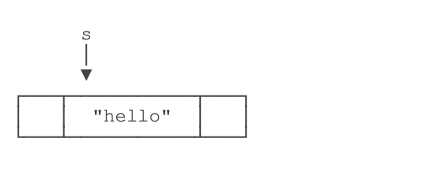

2. 紧接着，执行s = "world";时，JVM虚拟机先创建字符串"world"，然后，把字符串变量s指向它：

   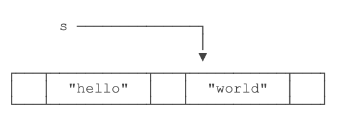

3. 原来的字符串"hello"还在，只是我们无法通过变量s访问它而已。因此，字符串的不可变是指字符串内容不可变。

## 空值null

引用类型的变量可以指向一个空值null，它表示不存在，即该变量不指向任何对象。例如：

```
String s1 = null; // s1是null
String s2; // 没有赋初值值，s2也是null
String s3 = s1; // s3也是null
String s4 = ""; // s4指向空字符串，不是null
```

注意要区分空值null和空字符串""，空字符串是一个有效的字符串对象，它不等于null。

# 数组类型

如果我们有一组类型相同的变量，例如，5位同学的成绩，可以这么写：

```java
public class Sources {
    public static void main(String[] args) {
        // 5位同学的成绩
        int n1 = 68;
        int n2 = 79;
        int n3 = 91;
        int n4 = 85;
        int n5 = 62;
    }
}
```

但其实没有必要定义5个int变量。可以使用数组来表示“一组”int类型。代码如下：

```java
/**
 * 数组
 */
public class Sources {
    public static void main(String[] args) {
        // 5位同学的成绩
        int[] ns = new int[5];
        ns[0] = 68;
        ns[1] = 79;
        ns[2] = 91;
        ns[3] = 85;
        ns[4] = 62;
    }
}
```

定义一个数组类型的变量，使用数组类型“类型[]”，例如，int[]。和单个基本类型变量不同，数组变量初始化必须使用new int[5]表示创建一个可容纳5个int元素的数组。

Java的数组有几个**特点**：

- 数组所有元素初始化为默认值，整型都是0，浮点型是0.0，布尔型是false；
- 数组一旦创建后，大小就不可改变。

要访问数组中的某一个元素，需要使用索引。数组索引从0开始，例如，5个元素的数组，索引范围是0~4。

可以修改数组中的某一个元素，使用赋值语句，例如，ns[1] = 79;。

可以用`数组变量.length`获取数组大小：

```
// 5位同学的成绩
int[] ns = new int[5];
// 输出：5
System.out.println(ns.length);
```

数组是引用类型，在使用索引访问数组元素时，如果索引超出范围，运行时将报错(数组越界)：

```java
package com.learn.arrays;

/**
 * 数组越界，抛出异常
 *
 * @author jinglv
 * @date 2021/5/14 11:17 上午
 */
public class ArrayBound {
    public static void main(String[] args) {
        // 5位同学的成绩
        int[] ns = new int[5];
        int n = 5;
        /*
         输出结果：
         Exception in thread "main" java.lang.ArrayIndexOutOfBoundsException: Index 5 out of bounds for length 5
	            at com.learn.arrays.ArrayBound.main(ArrayBound.java:14)
         */
        System.out.println(ns[5]);
    }
}
```

定义数组时直接指定初始化的元素，这样就不必写出数组大小，而是由编译器自动推算数组大小。例如：

```
int[] ns = new int[] { 68, 79, 91, 85, 62 };
```

还可以进一步简写为：

```
int[] ns = { 68, 79, 91, 85, 62 };
```

注意数组是引用类型，并且数组大小不可变。我们观察下面的代码：

```java
package com.learn.arrays;

/**
 * 数组是引用类型，并且数组大小不可变
 *
 * @author jinglv
 * @date 2021/5/14 11:24 上午
 */
public class NotVariableArray {
    public static void main(String[] args) {
        // 5位同学的成绩
        int[] ns;
        ns = new int[]{68, 79, 91, 85, 62};
        // 结果：5
        System.out.println(ns.length);
        ns = new int[]{1, 2, 3};
        // 结果：3
        System.out.println(ns.length);
    }
}
```

数组大小变了吗？看上去好像是变了，但其实根本没变。

对于数组ns来说，执行ns = new int[] { 68, 79, 91, 85, 62 };时，它指向一个5个元素的数组：

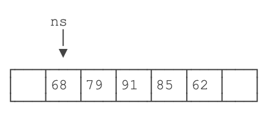

执行ns = new int[] { 1, 2, 3 };时，它指向一个新的3个元素的数组：

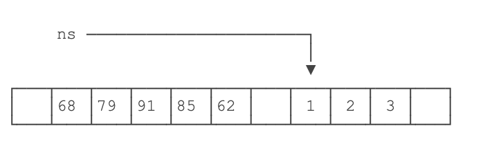

但是，原有的5个元素的数组并没有改变，只是无法通过变量ns引用到它们而已。

## 字符串数组

如果数组元素不是基本类型，而是一个引用类型，那么，修改数组元素会有哪些不同？

字符串是引用类型，因此我们先定义一个字符串数组：

```
String[] names = {
    "ABC", "XYZ", "zoo"
};
```

对于String[]类型的数组变量names，它实际上包含3个元素，但每个元素都指向某个字符串对象：

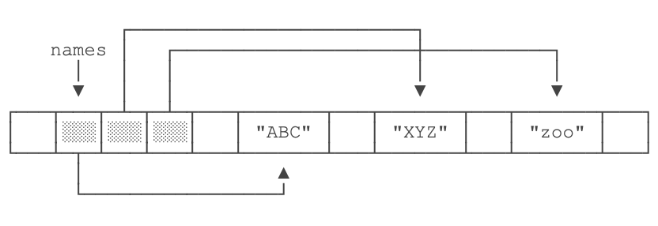

对names[1]进行赋值，例如names[1] = "cat";，效果如下：

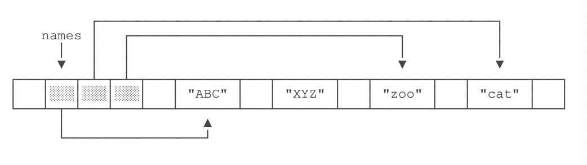

这里注意到原来names[1]指向的字符串"XYZ"并没有改变，仅仅是将names[1]的引用从指向"XYZ"改成了指向"cat"，其结果是字符串"XYZ"再也无法通过names[1]访问到了。

## 总结

数组是同一数据类型的集合，数组一旦创建后，大小就不可变；

可以通过索引访问数组元素，但索引超出范围将报错；

数组元素可以是值类型（如int）或引用类型（如String），但数组本身是引用类型；

